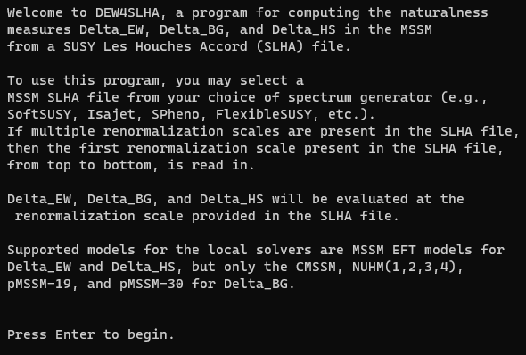
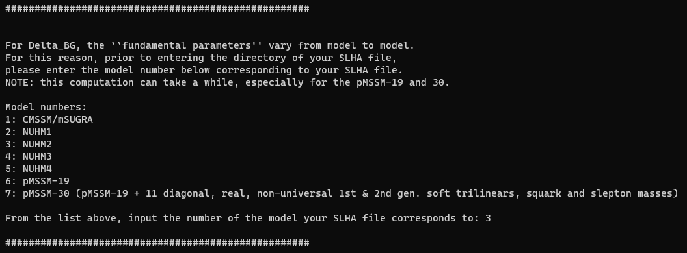
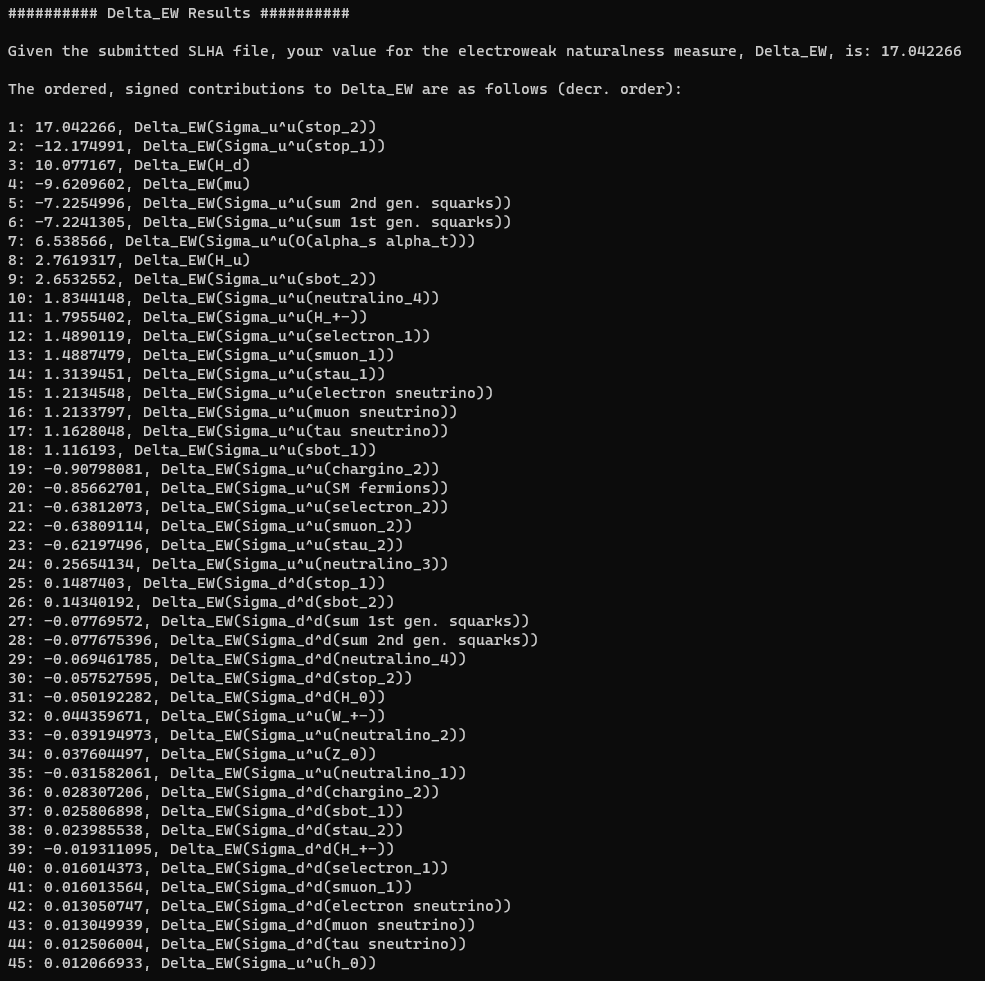
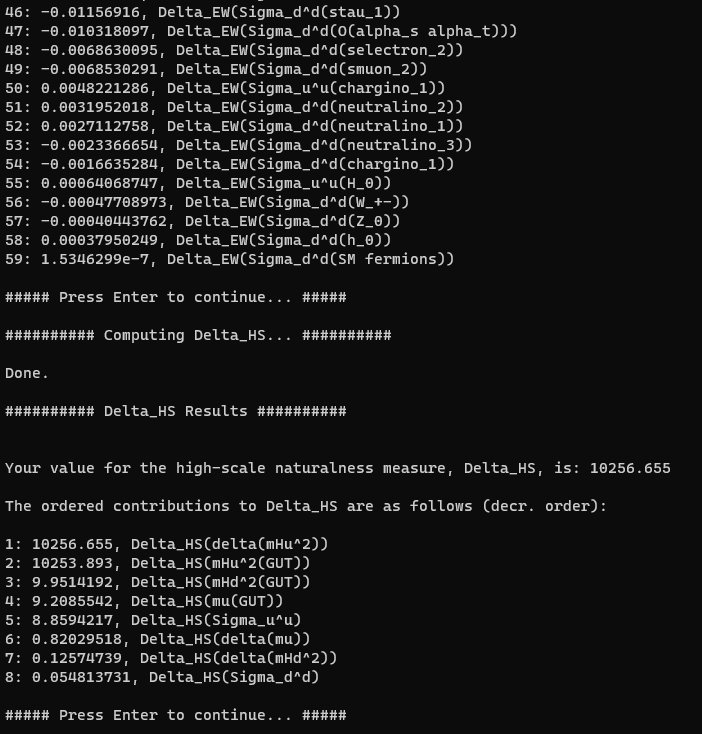
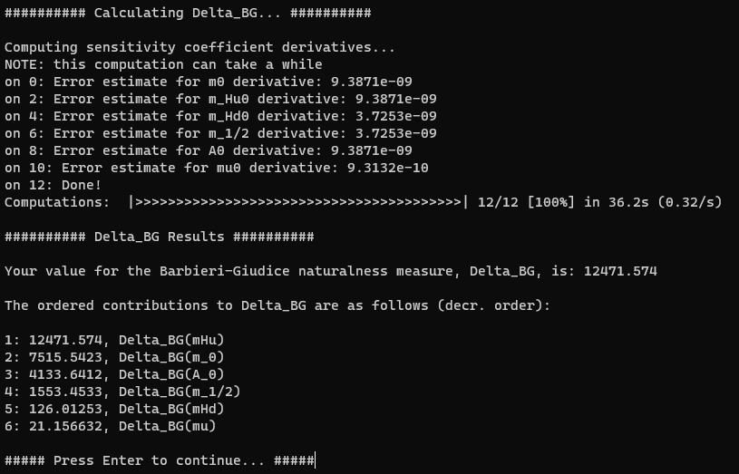

# DEW4SLHAv1.3
This program computes the naturalness measures $\Delta_{EW}$ (DEW) and produces an ordered list of contributions to DEW from the one-loop and partial two-loop Higgs minimization conditions using the effective potential method and a user-provided input SLHA file from the user's choice of spectrum generator. For versions later than v1.3, the program also computes the naturalness measures $\Delta_{HS}$ and $\Delta_{BG}$ for the user-input SLHA file. This documentation is for v1.3.

# Installation
There are two main options for obtaining and running DEW4SLHA. The first is perhaps the simplest: a standalone executable for DEW4SLHA, precompiled into the C language using [Pyinstaller](https://pyinstaller.org/en/stable/). Obtain the file `DEW4SLHAv1_3.tar.gz` or equivalently `DEW4SLHAv1_3.zip` from the GitHub releases (https://github.com/Dmartinez-96/DEW-Calculator/releases/tag/DEW4SLHAv1.3). Put this archive in the desired location for the DEW4SLHA program to live. 

**NOTE**: The DEW4SLHA routine is written nearly exclusively in Python3, specifically Python3.9.16. Installing a Python3 compiler is straightforward on most systems -- however, for the user's convenience, DEW4SLHA is packaged here and should function as a standalone executable together with its supporting source code, independent of whether a system has a Python interpreter installed or not. The tradeoff here is that the file size is rather large, as the compiler for Python is packaged into the executable here, together with all dependencies, so that the user's need for installation is minimized.  

Now unpack this archive. For example, unpacking a `tar.gz` archive with an Ubuntu 22.04 terminal could entail using the command:

`cd /path/containing/DEW4SLHAv1_3.tar.gz/archive/`

`tar -xvzf DEW4SLHAv1_3.tar.gz`

`cd DEW4SLHAv1_3`

Alternatively, if one were to just want the Python scripts for use in their own Python environment, details on packages needed are below. Instead of downloading the large executable, precompiled version, the scripts can be downloaded from [GitHub](https://github.com/Dmartinez-96/DEW-Calculator/releases/tag/DEW4SLHAv1.3) as a tarball or ZIP file from `DEW4SLHAv1_3_py.tar.gz` or `DEW4SLHAv1_3_py.zip`. Click on the type of compressed archive you want to download and download them from here.

## Standalone executable installation (no Python required)
This unpacked archive now contains the two methods by which DEW4SLHAv1.3 can be run. If you are running the standalone executable, installation is complete with the exception of possibly ensuring the system has a C compiler properly installed, such as `gcc`. 

## Pythonic version installation
If instead, you would prefer to use the functionally equivalent Python script, ensure you have Python3 installed on your system (see [the Python website](https://www.python.org/downloads/) for info on how to download and install Python for your system). It is recommended to have Python version $\geq$ 3.9.16.

Using a package manager such as `pip` (or `conda`, though some packages such as `pyslha` are outdated as of June 2023 in the standard `conda` repositories -- `pip` should be used here), ensure you have the following Python packages installed. Below is a table providing the package name, recommended version number, and a link to the information pages for these packages. 

|   **Package**  | **Recommended version** |                   **Links**                       |
|:--------------:|:-----------------------:|:-------------------------------------------------:|
|     `numpy`    |          1.23.0         |       [Source](https://numpy.org/install/)        |
|     `scipy`    |          1.10.0         |       [Source](https://scipy.org/install/)        |
|`alive-progress`|          3.1.4          |[Source](https://github.com/rsalmei/alive-progress)|
|    `mpmath`    |          1.2.1          |           [Source](https://mpmath.org/)           |
|    `pyslha`    |          3.2.5          |    [Source](https://pypi.org/project/pyslha/)     |

Make sure that the Python script compressed archive you downloaded has been extracted. For example, on Ubuntu 22.04 with a `tar.gz` archive, do:

`cd /path/to/where/DEW4SLHAv1_3_py.tar.gz/lives/`

`tar -xvzf DEW4SLHAv1_3_py.tar.gz`

`cd DEW4SLHAv1_3_py`

# Startup Instructions

## Standalone executable
After having extracted the `DEW4SLHAv1_3.tar.gz` file, open bash or a terminal and change directory into the parent folder:

`cd /path/to/DEW4SLHAv1_3/`

Change directory to where the executable file lives:

`cd /path/to/DEW4SLHAv1_3/exe/DEW4SLHAv1_3/`

From here, the user can execute the program:

`./DEW4SLHA.x`

`DEW4SLHA.x` is a wrapper script linking into the relevant, precompiled files in the `.../src/` directory. You may need to grant executable permission to the file. If the last line received a "permission denied" error, you can change the permissions of the file to be executable by the following command, for example:

`chmod +x DEW4SLHA.x`

**IMPORTANT:** Do not change the relative locations or names of files inside the `.../src/` directory.

## Python script
Make sure you are in the folder `/path/to/DEW4SLHAv1_3_py/`. With the proper packages installed, you can run the file `DEW4SLHA.x.py` from your Python compiler in a terminal. For example, if your terminal command for running Python programs is '`python`', then use the following command from a terminal to use DEW4SLHAv1.3:

`python DEW4SLHA.x.py`

`DEW4SLHA.x.py` is a wrapper script that links to the relevant files inside the `.../DEW4SLHAv1_3_py/src/` directory.

**IMPORTANT:** Do not change the relative locations or names of `DEW4SLHA.x.py` nor any of the files in the `DEW4SLHAv1_3_py/src/` directory. 

# Runtime Instructions

Many of the runtime instructions are included on-screen to walk the user through the options in DEW4SLHA. Here is an example using an electroweak natural benchmark point, generated by SoftSUSYv4.1.12, from the NUHM2 (non-universal Higgs mass, 2 extra parameters) model with $m_{0}=5000$ GeV, $m_{1/2}=1200$ GeV, $A_{0}=-8000$ GeV, $m_{\text{top}}=173.2$ GeV, $\mu=200$ GeV, and $m_{A}(\text{pole})=2$ TeV.

Upon first loading DEW4SLHA, either via the executable in the terminal or the Python script in the terminal, you will be met with a screen looking similar to the image below. This provides the user with basic information on DEW4SLHA.

After pressing enter to continue, the user is informed of DEW4SLHA's default calculation of the electroweak fine-tuning measure $\Delta_{EW}$. The user is prompted on whether to include the calculation of the high-scale naturalness measure, $\Delta_{HS}$, as below:

The user is similarly prompted regarding the Barbieri-Giudice naturalness measure $\Delta_{BG}$:

Should the user choose to evaluate $\Delta_{BG}$, further information will be required before the computation can proceed. In particular, the user must select the model (available models include the CMSSM, NUHM(1,2,3,4) models, pMSSM-19, and the pMSSM-30) they wish to evaluate $\Delta_{BG}$ within, as well as the precision level for evaluating the derivatives in $\Delta_{BG}$ numerically, as portrayed below.

With the configuration complete and successful, the user should next see a screen similar to below, prompting them for the location of their SLHA file.

The path should be included as an absolute path (i.e., `/home/usr/path/to/SLHA/file` or similar), but relative paths from the `DEW4SLHA.x` executable or `DEW4SLHA.x.py` script should work fine, too (e.g., if `mySLHA` file was in the directory `.../DEW4SLHAv1_3/exe/DEW4SLHAv1_3/mySLHAfiles/`, then inputting the path "`mySLHAfiles/mySLHA`" should work if you haven't moved the executable or source files). You will know you were successful upon seeing a screen like below:

The calculation will then proceed on its own accord to evaluate $\Delta_{EW}$, after which an ordered and signed list of results for 59 individual contributions to $\Delta_{EW}$ from greatest to least, like the one below, will be printed onto the screen. The user may wish to take the time to read these results before pressing enter to continue.

Later, this output can be optionally saved to a text file, should the user wish to do so.

If the user chose to also evaluate $\Delta_{HS}$, then a similar process will occur on screen until a list with the eight contributions to $\Delta_{HS}$ from greatest to least, like the one below, will be printed. If the user did not choose to evaluate $\Delta_{HS}$, this step will not occur.

If the user chose to also evaluate $\Delta_{BG}$, then a similar process will occur on screen. The $\Delta_{BG}$ calculations are much more involved numerically than their electroweak or high-scale cousins, so this calculation can be time-intensive. Computation time is dependent on model choice, as well as the precision level selected. The three precision options are:

| Precision level | Numerical derivative approx. method | Time req. relative to low precision |
|:---------------:|:-----------------------------------:|:-----------------------------------:|
|        3        | 8-point finite central differences  |             $4\times$               |
|        2        | 4-point finite central differences  |             $2\times$               |
|        1        | 2-point finite central differences  |             $1\times$               |

The calculation progress is tracked via a progress bar onscreen, courtesy of the `alive-progress` Python package, providing the user with an active interface to track their computation, including error estimates on the derivatives. 

After the computations are complete, a list with the various contributions to $\Delta_{BG}$ from greatest to least, like the one below, will be printed. If the user did not choose to evaluate $\Delta_{BG}$, these relevant step will not occur.

The user is then prompted on whether to save their results, as well as the naming scheme by which they would like to save their results. The default filename format is `current_system_time_Dxx_contrib_list.txt`, where "`xx`" is "`EW`", "`HS`", or "`BG`" as suggested by the corresponding prompts. The program will generate an output folder if one does not exist and tell the user where their results may be found.

Lastly, the user can either choose to try again with a new SLHA file from the beginning or quit the program altogether.

# FURTHER INSTRUCTIONS AND INFORMATION CAN BE FOUND AT [dew4slha.com](https://dew4slha.com/).

## Acknowledgments

This software makes use of several third-party libraries:

- **Boost Libraries** (Boost Software License): [Boost website](https://www.boost.org/)
- **Eigen Libraries** (LGPL3+ License): [Eigen website](https://eigen.tuxfamily.org/)
- **GNU Scientific Library (GSL)** (GNU General Public License): [GSL website](https://www.gnu.org/software/gsl/)

Special thanks to the developers of these libraries for their invaluable contributions to the open source community.
